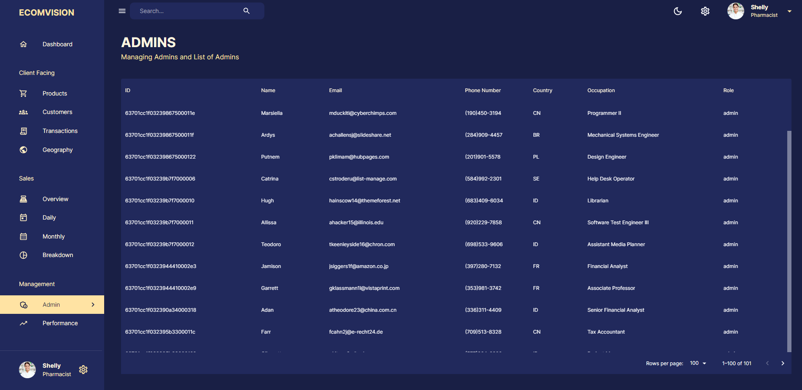

<h3 align="center">Fullstack Admin Dashboard</h3>

  <a href="https://admin-frontend-mqei.onrender.com/">Live Demo</a>

---

 Fullstack Admin Dashboard demo, made to learn more backend
                    concepts.
      

## 📝 Table of Contents
- [About](#about)
- [Built Using](#built_using)
- [Screenshots](#screenshots)
- [Credits](#credits)

## 🧐 About 
 MERN Stack Admin Dashboard. Frontend uses React, Material UI, Nivo Charts, Redux Toolkit and Redux Toolkit Query. Backend uses Node JS, Express Js, Mongoose, and MongoDB.

## ⛏️ Built Using 
- [React](https://react.dev/) - Web framework
- [Material UI](https://mui.com/) - UI Tools
- [Nivo Charts](https://nivo.rocks/) - Data Visualization
- [Redux Toolkit](https://redux-toolkit.js.org/) - State Management

- [NodeJs](https://nodejs.org/en/) - Server Environment
- [ExpressJS](https://expressjs.com/) - Backend Server
- [Mongoose](https://mongoosejs.com/) - Data Modeling
- [MongoDB](https://www.mongodb.com/) - Database

## Screenshots 

## ✍️ Credits 
- [EdRoh](https://github.com/ed-roh) - Tutorial
